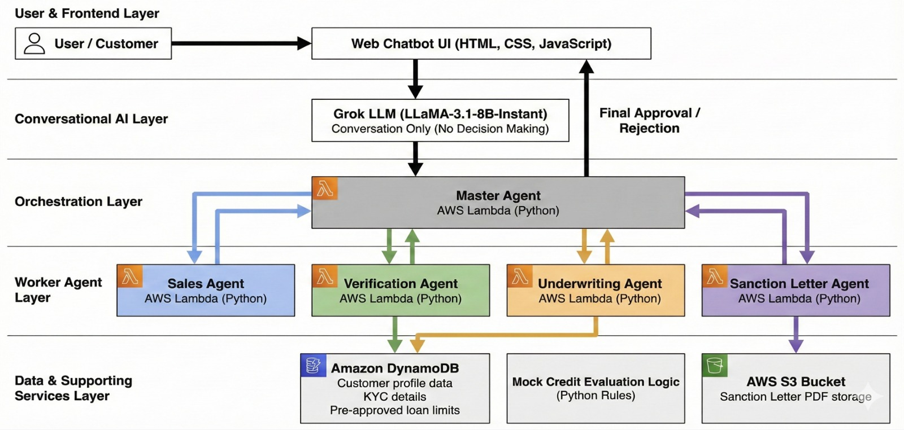

## 📌 Agentic-AI Loan Approval Chatbot

## 📖 Overview

This project implements an Agentic AI system designed to autonomously plan, execute, and evaluate tasks using machine learning models and modular components. The system follows a structured pipeline that enables decision-making, feedback loops, and performance evaluation.

The focus is on:

Modular architecture

Reproducibility

Clear separation of responsibilities

Quantifiable evaluation

## 🧠 Key Features

Agent-based decision logic

Modular ML inference pipeline

Feedback-driven improvement loop

Lightweight and extensible design

Reproducible experiments

## 🏗️ System Architecture

## 🧪 Experiments

Multiple task scenarios tested

Ablation studies on planner strategies

Evaluation performed over N iterations per task

## 📌 Future Improvements

Multi-agent collaboration

Reinforcement learning-based planning

Distributed execution

Enhanced evaluation metrics
