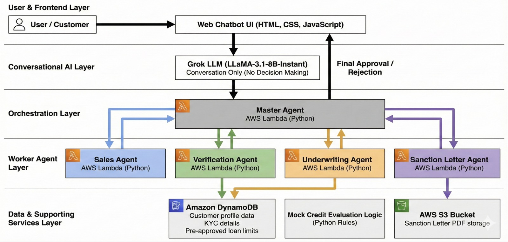

## 📌 Agentic-AI Loan Approval Chatbot

## 📖 Overview

Agentic AI–powered loan sales chatbot that simulates a human BFSI sales executive. Uses a Master Agent + Worker Agents architecture with deterministic orchestration and LLM-driven conversation to handle context-aware dialogue, emotion-aware branching, consent-based EMI disclosure, and end-to-end workflows from chat to issuing mock sanction letters.

This project implements an Agentic AI system designed to autonomously plan, execute, and evaluate tasks using machine learning models and modular components. The system follows a structured pipeline that enables decision-making, feedback loops, and performance evaluation.

The focus is on:

Modular architecture

Reproducibility

Clear separation of responsibilities

Quantifiable evaluation

## 🧠 Key Features

Agent-based decision logic

Modular ML inference pipeline

Feedback-driven improvement loop

Lightweight and extensible design

Reproducible experiments

## 🏗️ System Architecture

## Landing Page

## 🧪 Experiments

Multiple task scenarios tested

Ablation studies on planner strategies

Evaluation performed over N iterations per task

## 📌 Future Improvements

Multi-agent collaboration

Reinforcement learning-based planning

Distributed execution

Enhanced evaluation metrics
